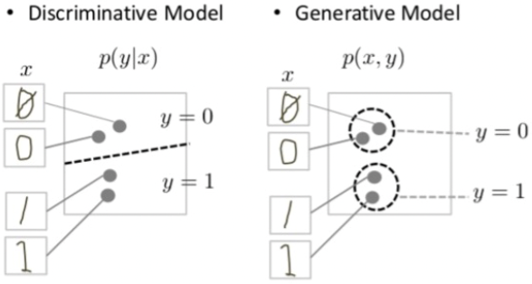
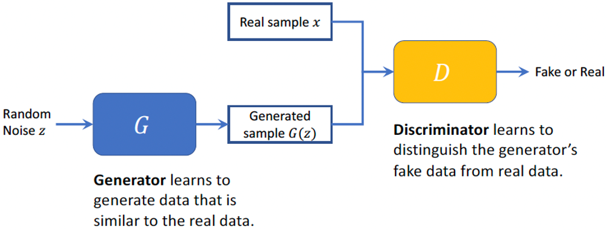

# Generative Adversarial Networks

## Generative Adversarial Networks
**Generative Models** aim to learn the underlying distribution of the data in order to genereate new data samples that resemble the original dataset. It models $P(X|Y)$, ***i.e.*** it provides the probability of the input data $X$ to be of a certain class $Y$.

**Adversarial**, in this context, refers to a **Discriminative Model**, in which the model learns to differentiate between real and fake data. It models $P(X,Y)$, ***i.e.*** it provides the probability of the input data $X$ to be within the distribution area of a given class $Y$.

**Networks**, in this context, refers to the use of **Neural Networks** within the model.

A **Generative Adersarial Network (GAN)** contains two neural networks that are competing against each other; a **Generative Network** which learns to generate data that is similar to real data, and a **Adversarial Network** which will learn to distinguish between the generative model's data sample against real data samples.

...Slides 12 and onwards...