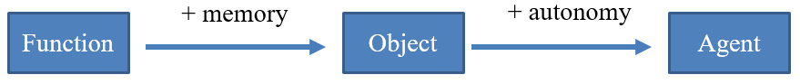

# Introduction

## Intelligence
AI typically take form as systems that:

* Are able to **Think and/or Act** in a way that **Align with the History**. In other words:
    * Use **Previous Knowledge** (*i.e.* **History**)
    * To make informed **Answers/Predictions** (*i.e.* **Act**)
    * Or develop certain **Behaviours** (*i.e.* **Think**).
* Are able to **Think and/or Act** in a **Rational** way. Which typically involves mimicing **Human Behaviour**, and perform **'Perfect' Actions** with **Understanding** of the underlying rules and constraints of the environment/world its learning from. The **Latter** leads on to **Game Theory**.

In constructing **Artificial Intelligence**, the **Former** form is commonly referred to as **Artificial Narrow Intelligence**, and the **Latter** form is referred to as **Artificial General Intelligence**.

...

## Agents
The formal definition of an **Agent**, is a **Computer System** that is capable of **Independent** actions, without being told or programed to act a certain way. It is a **Discrete Entity** that has its own **Goals** and **Behaviours**. And if it is also **Autonomous**, then it is also then capable of **Modifying** its behaviour to achieve more goals, or achieve it at as little cost as possible.

**Intelligent Agents** are able to interact with its environment using **Actions**, and using sensors can obtain **Past Experiences** as feedback from acting on the environment.

## Preferences
From a **Set of Certain Outcomes**, $\Omega = \{o_1,o_2,...\}$

An agent can have **Preferences** as to what kind of outcome it prefers, *e.g.* $o_1 \gt o_2$, $o_1 \sim o_2$, $o_1 \geq o_2$

Using these preferences, an agent can also apply **Axioms** to obtain the best outcome from the set:
* Completeness
* Transitivity
* Continuity
* Independence

...

## Utility
**Utility** is a kind of currency, that encourage agents to perform certain actions and develop certain behaviours, to typically **Maximise** the amount of utility that the agent can gain.

**Expected Utility** is the amount of **Utility** that is expected to be gained, in cases where **Uncertainty** in the form of **Probability** is introduced.

## Rationality
**Rational** behaviour involves **Strategic Decision-Making**. Which in situations that normally involves **Self-Interested** individuals/agents, they think and act rationally to obtain the best outcome (normally to maximise its utility).

**Perfect Rationality** involves **Complete** information, and **Unlimited** computational resources. The most optimal outcome can be achieved with complete knowledge on every action and result, and the computational resources to obtain this knowledge, or develop the perfect behaviour to best adapt to every situation.

**Bounded Rationality** is usually expected however. Since it involves cognitive limitations of humans, computational constraints of computer systems, and often approximation of information. This as well as many other problems, result in **Incomplete** and partially **Inaccurate** information, which makes it difficult to obtain the perfect solution to a given problem.

## Risk
Most situations an agent would encounter involves uncertainty. And there are various approaches to uncertainty an agent can use:
* **Risk-Averse** in which options with higher **Certainty** are preferred despite obtaining a **Lower** expected utility.
* **Risk-Neutral** in which options that **Maximises** expected utility are chosen, which may not be the **Highest** utility that can be obtained.
* **Risk-Seeking** in which options that can give the **Highest** expected utility is chosen, despite the option having **Higher** uncertainty.

## Reading
**Chp** 2,16 - AI: A Modern Approach