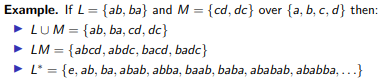
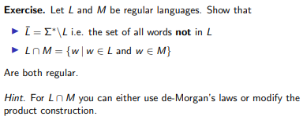

# Regular Operations

## Regular Operations
RO are operations that can be done on regular langauges. Given two languages $L$ and $M$ from the same alphabet $\sum$, the regular operations that can be performed are:

* **Union**, $L \cup M := \{w | w \in L$ or $w \in M\}$
* **Concatenation**, $LM := \{uv | u \in L$ and $v \in M\}$
* **Kleene Star**, $L* := \{w_1...w_n | n \geq 0$ and $w_i \in L\}$

Here are some examples:

Additionally, given that $L$ and $M$ are also regular languages, then the union, cocatenation, and kleene star of these languages are also regular langauges. This can be proven by constructing a finite automata that accepts these regular operations, which are in fact possible.

## Closure
This is **Closure under Union**:
1. Take DFAs/NFAs A and B accepting L and M.
2. Add a fresh initial state, and connect this to the initial state of A
and the initial state of B using two jump arrows.
3. The result is an NFA that accepts L ∪ M.

This is **Closure under Concatenation**:
1. Take DFAs/NFAs A and B accepting L and M.
2. Connect A and B by adding a jump arrow from each accepting state
of A to the initial state of B.
3. Make all accepting states of A non-accepting.
4. The result is an NFA (whose initial state is that of A and whose
accepting states are those of B) that accepts LM.

This is **Closure under Kleene Star**:
1. Take a DFA/NFA A that accepts L.
2. Add a fresh initial state, make this accepting, and connect it to the
initial state of A using a jump arrow.
3. Connect all accepting states of A to the new initial using jump
arrows.
4. Make all accepting states of A non-accepting (so the only accepting
state is the new initial state).
5. The result is an NFA that accepts L.

## Extra

