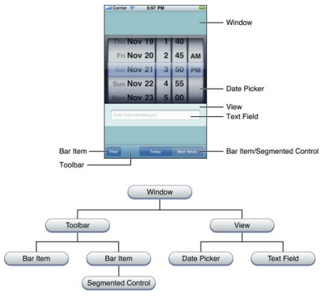

# Interaction Fundamentals

## Fundamentals
Interactive systems require a **Computer**, a **Human** and an **Interface**.

The **Computer** takes an input and produces and output, this is the most basic behaviour all systems does. It can be **Deterministic** and thus always return a certain output given certain inputs, everytime. Any form of **Unpredictability** is always caused by the inputs; bugs in the computer would cause this, but they perform as it is designed, so if badly then it will perform badly.

Inputs are provided in different ways, and give different kinds of data:
* **Low-Level** events include keystrokes, mouse positions, the UP and DOWN buttons, etc. Presumably, these do not require the UI to process.
* **High-Level** inputs where UI processes are, presumably performed, such as clicks, taps, text strings, gestures, etc.

The UI is meant to provide **control** through which users express inputs in a valid structure. The inputs may be **implicit** and or **explicit**, as well as have a **default**. Some examples:
* **Buttons**, which usually only responds to the mouse or tapping the screen. Though some inputs like the ENTER button can trigger the buttons as well.
* **Textbox**, which (i think) exclusively responds to keystrokes, which accepts Unicode strings containing characters, which is parsed into higher-level structure of keywords.

## Paradigms for Interfaces
Most interfaces abide by the **WIMP Paradigm**. It has become a standard in industry for guiding how UI is to be designed around. These are:
* **Windows**, provide a solution in visual access, especially for content that is larger than the size of a screen. Content is often enclosed in a window, which can only be directly interacted with within that window. There can be multiple windows with different content, and navigation between these windows allow for ease of access and use of its content. *E.g.* Tabs, and Windows that can be navigated through using ALT + TAB.
* **Icons**, provide visual access to discrete programs and documents, as well as map actions to a pointing device, which would otherwise require commands to perform. It is important to note where the starting icon/window is, as to be used to provided all the other icons that can be used.
* **Menu**, provide a means for users to access commands without requiring a user to understand the syntax and commands. This requires pointing structures as well, to make it easier to interact with. Features like **Widgets** can also work as menus, but by soliciting only the inputs required for the command, as either buttons or sliders.
* **Pointers**, presumably the pointer structures and devices that enable **Icons** and **Menus** to work.

The interaction style used by WIMP interfaces is called **Direct Manipulation**. The characteristics of Direction Manipulation are:
* Continuous representation of the object of interest
* Physical actions as opposed to complex syntax
* Reversible, with incremental actions via continuous feedback

## Functional Interfaces
Functional interfaces require that:
* Events are handled for inputs
* Rendering of the UI as outputs
* And managing the application state

**UI Buttons** are simple inputs, and so is its architecture. It can be easily represented with a state-transition diagram, granted the design of the buttons can be configured to do many different actions:
* Buttons will either be in a **Up** or **Down** state.
* When the button is **Pressed Down**, is transitions from **Up** to **Down**. And vice versa, for when it is **Released**.

**Model-View-Controller (MVC)** is a nearly ubiquitous pattern for implementing these state machines. It (clearly) consists of the:
* **Model**, which stores the data the UI is processing. ***E.g.*** A scroll bar's data is the window position over the content it displays.
* **View**, which visualizes the data. ***E.g.*** Drawing the "trough" and the "handle" to show which portion is visible.
* **Controller**, which manages the state machine, by transitioning to states in response to events, executing commands, and updating the model. ***E.g.*** Updating the window position in the model.

**View Hierarchies** structures the UI in a hierarchical way. The hierarchy is designed off of widgets appearing contained within other windows and sections. As shown:

...