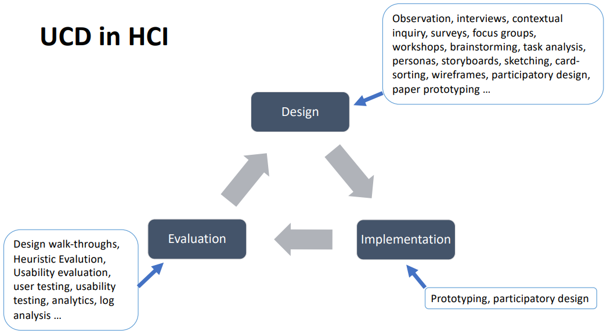

# Requirements Gathering

## Methods on Gathering Requirements
The following describe some methods on gathering requirements for task analysis:
* **Documentation**, it can be centered around the **Job**, **Operation** or **Device** that ...
* **Observations**, which can be **Passive** or **Active**, and either as **Direct** or **Indirect**. By observing what people do and what actually happens. ...
* **Interviews**, which can be **Semi-Structured** or can be **Questionnaires**. The former would have prepared questions to ask, but allow for flexibility in the kinds of questions that can be asked; the latter, is more rigid and lower cost, but would typically not provide detailed information or much context.
* **Think-Aloud Protocols**, which are verbal reports provided by a person completing the task, which will normally be highly detailed on goals, plans, procedures, actions and objects. The information can be taken **Concurrently**, while the person is performing the task, or **Retrospectively**, after the person has performed the task, and trace back on memory to provide the information.

## UCD in HCI

What, how and why...

## Requirements
**Requirements** are statements about an intended product that specifies what it is expected to do or how it will perform.

...

## Interviews
...

## Questionnaires
...

