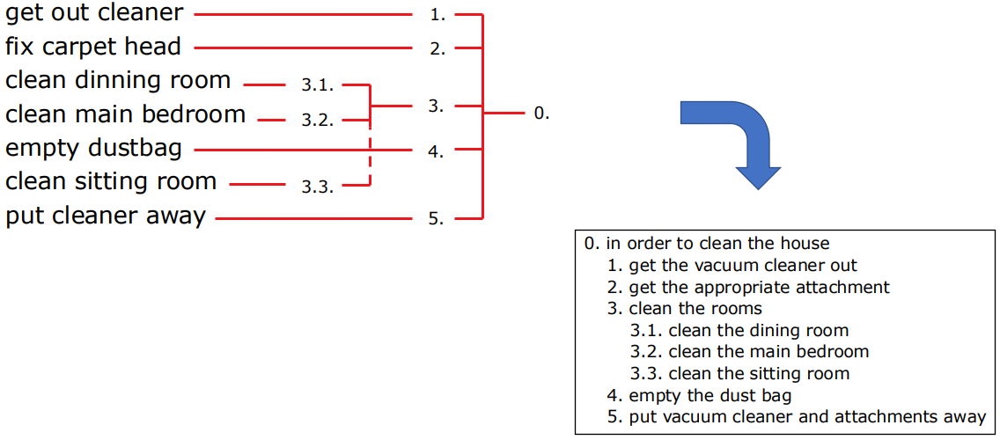

# Task Analysis

## Introduction to Task Analysis
**Task Analysis** is an important tool in informing UI requirements and designs at the **Design** phase of the design process. It is includes methods that analyses the **Underlying Rationale and Purpose** of what people are doing, as performing individual tasks in their work, before considering the product itself. It identifies:
* What are they trying to achieve?
* Why are they trying to achieve it?
* What must they know?
* What things do they work with?
* How are they going about it?

As stated, it is used to investigate an **Existing Situation**, and identify **Existing Practises** to build on as a foundation to build new requirements or design new tasks.

## History of Task Analysis
...

## Differnce to Other Techniques
...

[Task Analysis Pt1, Pg 26-](/2ndYear/HCI1/Slides%20(HCI1)/2.1%20User%20Centered%20design%20_%20OHCC.pdf)

## Approaches to Task Analysis
There are three different approaches to task analysis:
* **Task Decomposition**
* **Knowledge-Based Techniques**
* **Entity-Based Analysis**

## Task Decomposition
**Task Decomposition** aims to:
* **Describe** the **Actions** user do
* **Structure** them within a **Task-Subtask Hierarchy**
* **Order** the **Subtasks** as 'plans'

There are also two different **Types** of task decomposition:
* **Hierarchical Task Analysis (HTA)**, which will be covered.
* **ConcurTaskTrees (CTT)**, which uses **LOTOS** temporal operators. Will not be covered.

Here is an **Example** of parsing a list of tasks and subtasks into a HTA:

After obtaining a HTA, it may be required to **Refine** it. This is done to ensure that:
* **Actions** are correctly **Paired**
* **Restructure** is applied as necessary
* **Tasks** can be made **Balanced** in simplicity and clarity
* **Tasks** are appropriately **Generalised**

As an **Example**:

**Plans**, as previously mentioned, are ordered subtasks. As to how it is 'ordered' and illustrated can depend on what type of plans is desired. These **Types** of plans include, and or contain multiple of types of:
* **Fixed** sequence plans: do 1.1 then do 1.2 then do 1.3.
* **Optional** tasks: if 'the pot is full', then do 2.
* **Wait** tasks, the user waits for the conclusion of events. E.g. when 'kettle boils', then do 1.4.
* **Cycles**: do 5.1 then do 5.2 while there are still 
empty cups.
* **Time-sharing**: while doing 1; at the same time do X
* **Discretionary**: do any of 3.1, 3.2 or 3.3 in any order.

**Waiting** can be considered as a task, where waiting is considered an **Action**; or as a plan, where waiting is considered an **Event**.

## Knowledge-Based Techniques
**Knowledge-Based Techniques** put a focus on **Objects** and **Actions**. And include **Taxonomises** which act as a hierarchical structure for objects and actions. An **Example** of this is seen below:

...

## Entity-Based Analysis
**Entity-Relationship Techniques**, as the method used in entity-based analysis, ...

## Uses and Limitations of Task Analysis
...

[Task Analysis Pt2, All](/2ndYear/HCI1/Slides%20(HCI1)/2.2%20Task%20analysis_OHCC_2024_wanswers.pdf)
