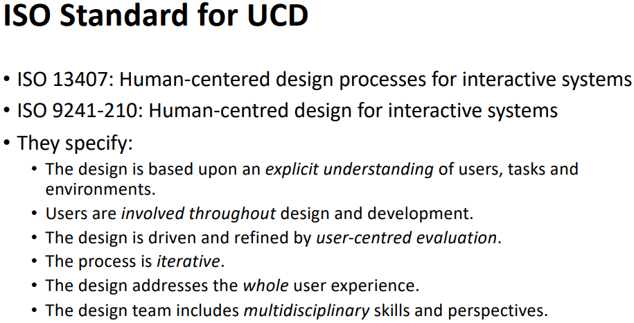

# User-Centered Design

## User-Centered Design
**System-Centered Designs** focuses on providing as much functional details, as opposed to making the design more user-friendly. This design contains all the functions and options, that allows it to perform actions, and configure settings; and is generally the easiest way to program and work with as a developer.

**User-Centered Designs** puts the user at the center of its design, and builds around optimizing the users' experience. There are three **Principles** to UCDs:
* True **Clarity** of user and task requirements
* **Integration** of user feedback **Iteratively**
* **Active Involvement** of the user throughout the design process starting early

In UCD, it is important to consider the users' perspective during all phases of the **Development Lifecycle**. Aspects may include the:
* Abilities, needs and wants of the user
* Goal, motivations and triggers
* Needed context for its use
* Tasks, activities and behaviours
* Obstacles and limitations

An **Iterative UCD** implements various methods for user-participation in the **Design Process**, and within each phase, these methods are included in:
* **Design**, which is the start and involves observations, interviews, surveys, focus groups, task analysis and various others.
* **Implementation**, which is when the design is prototyped and interative worked on, and may involve participatory effort in designing or providing early feedback.
* **Evaluation**, which the implementation is evaluated.

## Aspects of UCD
There are many **Benefits** to UCDs:
* **Economic**:
    * Decreased development costs.
    * Increased revenue from sales.
    * Reduced training costs.
    * Reduced customer service costs.
    * Reduced maintenance costs.
* **Social**:
    * Increased adoption rates due to end-user buy-in.
    * Improved user productivity.
    * Higher-quality user experience.

The importance of involving users in designing and producing a product beyond imporving the product itself:
* **Manages Expectations**
    *  Minimising disappointments.
    * Training development and easy to adopt methods.
    * UCD can be part of development communication.
* Ownership:
    * Make the users active stakeholders.
    * Community vs individual ownership.

There are different types of users that can be involved in the design process, primarily differing in the level of and amount of time influencing the UCD:
* **Full** time; constant input, danger of developer perspective, large
commitment
* **Part** time; patchy input, and can be stressful.
* **Short** term; inconsistent across project life.
* **Long** term; consistent, but can lose touch with users.

**In-Direct** involvement in user feedback:
* Online Feedback Exchange (OFE) systems.
* Crowdsourcing design ideas to test a design.
* Citizen science (scientific research with public involvement).

There are still **Problems** with using UCD in the design process:
Users may be wrong - design is 
subjective
* Users may be resistant to change (“I’ve used the current system for years!”)
* Project funder may disagree with users’ input―ultimately they’re the ones paying for the design and development!
* Short-term costs in time and money.

There are also various **Standards** for UCD:

