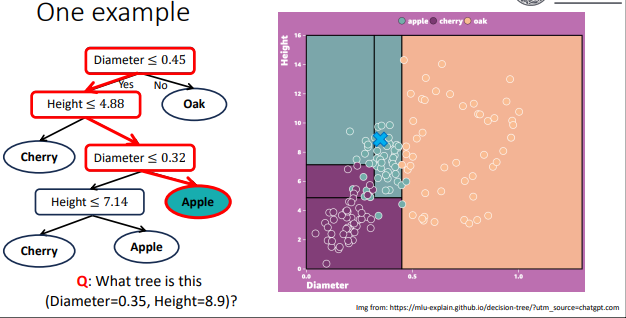

# Decision Trees

## Decision Trees
DTs are supervised learning models that predicts a target variable by recursively splitting data into a tree-like structure of decisions. It mimics the logical reasoning that humans use to make decisions.

This can be used for classification and regression tasks. ***E.g.*** of classification problem:

The decision tree consists of:
* A **Root Node**, the first descision node in the tree, and the start of the path.
* **Decision Nodes**, which will guide the path that the model will follow to reach the answer.
* **Leaf Nodes**, which are the final outcomes, indicating a class or containing a value.

## Entropy
**Entropy**, in thermodynamics, refers to the measure of **Disorder/Randomness** in a physics system. In infromation theory, it refers to the **Uncertainty** of the sample values in information. Entropy is measured between **Zero** and **One**, and the higher the value the more uncertain an outcome is to be. If zero, the outcome is completely predictable; if one, the outcome is completely uncertain.

The formula for the value of entropy is as follows:

$$E(S) = -\sum_{c=1}^c p_c log_2(p_c)$$

* $p_c$ is the probability of class $c$, or the fraction of datapoints of class $c$ in the decision node $S$
* $c$ is a unique class in the decision $S$

## Information Gain
**Information Gain** refers to the amount of uncertainty that is decreased after a split. The split refers to the addition of child nodes from a decision node.

For categorical data, the formula for calculating the information gain is:

$$IG(S,a) = E(S) - \sum_{v \in \Alpha} \frac{|S_v|}{|S|} E(S_v)$$

* $a$ is a specific attribute/feature
* $E(S)$ is the value of entroy before splitting the decision node
* $\Alpha$ is set of containing all possible features $a$
* $\sum_{v \in \Alpha} \frac{|S_v|}{|S|} E(S_v)$ is the value of entropy after splitting with feature $a$

In deciding to split a decision node, it is preferable to do so when entropy can be decreased, and not increased. So the aim for splitting a node $S$ is:
$$max_aIG(S,a)$$

Examples...

## Continuous Data
...