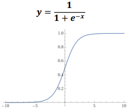

# Logistic Regression

## Classification
**Classification** problems deal with distinguishing between two or more **Classes**, **Types** or **Categorise**.

There are three different types of classification problems:
* **Binary** which involves only **Two** different answer, typically in **Yes/No** or **True/False** problems.
* **Multi-Class** which involes multiple classifications, but each input can only be in only **One** class. Typically used in basic classification problems, *e.g.* classifiying different animals.
* **Multi-Label** which involes multiple classifications, but each input can be in **Multiple** classes instead of only one. Typically in complex classification problems, *e.g.* classifying different facial features of people.

## Logistic Regression
LR is a **Linear Classifier** for binary outcomes, which can be extended for multi-class classification problems.

LRs are **Not** regression models.

## Logistic/Sigmoid Function

## Logistic Regression Hypothesis
...

