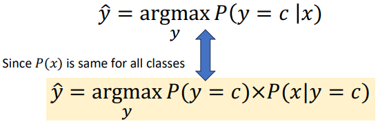
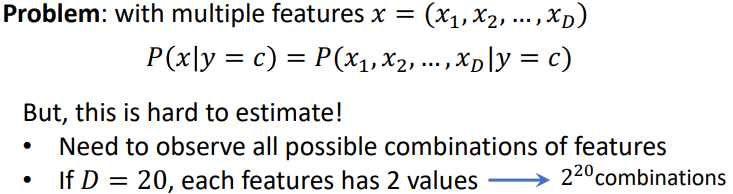
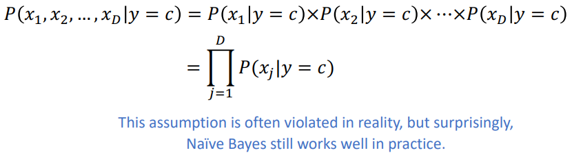
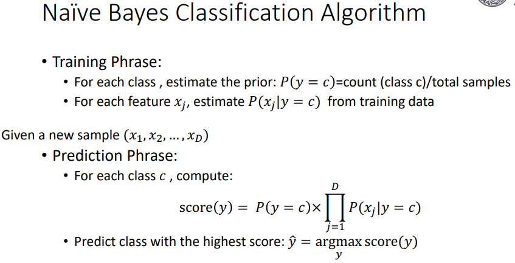
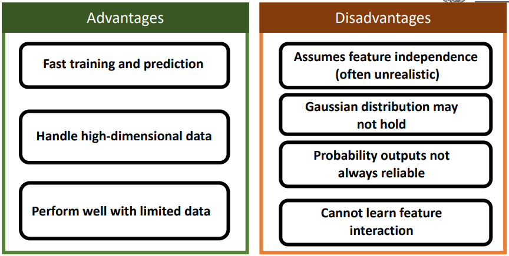

# Naive Bayes

## Bayes Theorem
**Naive Bayes** is a formula for obtaining the **Posterior**, the probability of $Y$ given $X$, from the **Likelihood**, the probability of $X$ given $Y$.

It is important to apply context however. ***E.g.*** $X$ will be a feature, and $Y$ will be a class. So the **Likelihood** shows the probability that something containing a given class, is to have a certain feature. And vice-versa.

Below is the definition of each type of probability:
* $P(X|Y)$ is the **Likelihood**.
* $P(Y|X)$ is the **Posterior**.
* $P(Y)$ is the **Prior**, which is typically the probability of a given class, before any data is provided.
* $P(X)$ is the **Marginal Probability**, which is typically the probability of observing a certain feature.

The **Bayes Theorem** is a way of combining our **Prior Knowledge** with **Observed Data** to compute a new **Conditional Probability**. This is given by the formula:
$$P(Y!X) = P(Y) \times \frac{P(X|Y)}{P(X)}$$

## Bayes Theorem to Classification
The **'Classification Goal'** is to model $P(y|x)$ where $x$ are given features, and $y$ is a predict class.

To make use of Bayes rule in classification problems, we can first get:
$$P(y = c|x) = P(y = c) \times \frac{P(x|y = c)}{P(x)}$$

Which will obtain the probability of a certain class given the feature input, then we can **Maximize** the **Posterior** as this:

A problem with this however is that this can only work with one feature, if there are multiple features, this wouldn't work. As seen below:

## The Naive Assumption
The **Naive Bayes Assumption** is that features are conditionally independent given the class. So that:

## Types of Naive Bayes
There are different types of Naive Bayes that can be used for different kinds of data. These are:
* **Multinomial Naive Bayes**, which is a method for **Categorical** data, where the feature type are event counts or frequencies; and it can be used for text classification or document calssification.
* **Bernoulli Naive Bayes**, which is a method for **Categorical** data, where the feature class is binary; and it can be used for binary text features, sentiment analysis, or spam detection.
* **Gaussian Naive Bayes**, which is a method for **Continous** data, where the feature class is continuous; like for height or diameter.

**Gaussian Naive Bayes** ...

[Naive Bayes, Pg 23-](/2ndYear/ML/Slides%20(ML)/w04A-NaiveBayes.pdf)

## Advan-Disadvan

When to use Naive Bayes:
* Working with high-dimensional sparse data
* Training data is limited
* Features are relatively independent
* Served as a baseline model quickly
* Example: text classification (spam detection, sentiment analysis, etc.)
