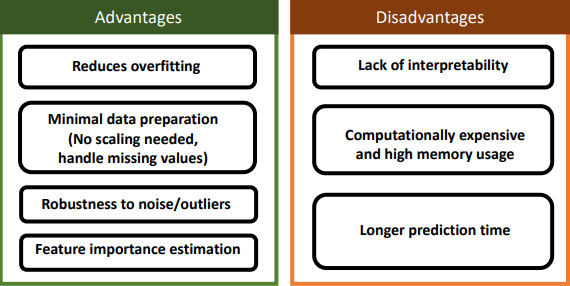
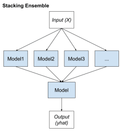
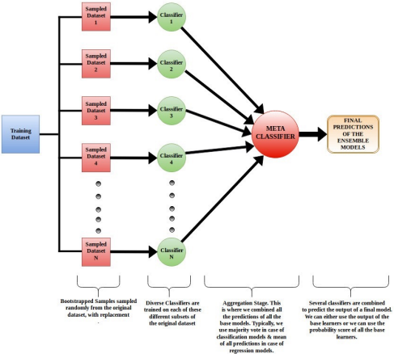
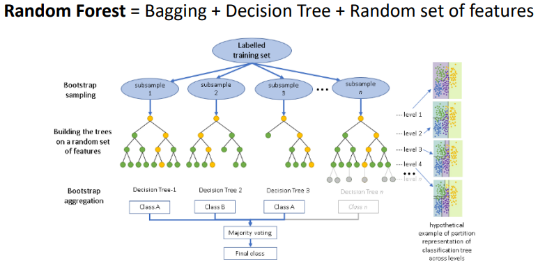

# Random Forests

## Random Forests
A **Random Forest** is an ensemble of decision trees, and the goal of it is to reduce variance and improve stability by combining many trees. It builds several decision trees, then averages the predictions of the trees; each tree is different in that each captures a different pattern from the data.

There are two main sources of randomness/diversity:
* **Bootstrap Sapling (Bagging)**, in which each tree is trained on a random subset of data (with replacement?).
* **Random Feature Selection**, in which each split considers only a random subset of features.

To construct a random forest:
* Create a bootstrapped dataset. ***I.e.*** the new dataset.
    * Select a random row from the dataset.
        * Since it is random, some rows may be selected multiple times, or not at all. But that's fine.
    * Append it to the new dataset for the given tree.
    * And repeat until the new dataset is of the same size as the orignal.
* Build a decision tree on this new dataset.
    * At each node only consider a random selection of $m$ features, where $m < D$. Typically where $m = \sqrt{D}$ for classification problems, and $m = m/3$ for regression problems.
* Repeat creating a bootstrapped dataset and building the decsion tree on it, multiple times, to eventually obtain many decision trees that are (usually) different from each other. Typically $100-500$ times to create a large enough forest.
* Finally, **Aggregate** the decision trees, in which the majority vote or average prediction value is obtained from the forest.

The result should be that:
* Variance is reduced, because of the randomness on the data samples
* Create diverse and decorralted trees, by exploring different combinations of feature, because of the random selection of those features.

## Out-Of-Bag Error
Since the bootstrapped dataset contains only a random subset of all the training dataset, there may be some data in which will not be used at all; typically 37% of the data is not in the bootstrap, which is called the **Out-of-Bag Error**. Which instead of being wasted, can instead be used as the validation set for the random forest, to tune the hyperparameters of the decision trees.

## Advan-Disadvan

## Ensemble Learning
**Ensemble Learning** is ...

There are different ways of using ensemble learning, these are:
* **Stacking**, in which there are different machine learning algorithms for each ensemble member; and a **Meta-Learner** that learns how to best combine these predictions.

* **Bagging**, which is the other method the random forest can use, in which multiple models are trained using a random subset of the original dataset wtih replacement.

    Or ig whatever this mess is:

* **Boosting**, in which the models learn from mistakes made by other models, in a sequential system where the model improve upon the mistakes of the previous model.

## Boosting
There are also different types of boosting methods:
* **AdaBoost (Adaptive Boosting)**
    * Decision Trees (stumps) + Boosting (adjust sample weights)
* **Gradient Boosting**
    * Decision Trees (shallow) + Boosting (fit to residual errors)

Extra content on **Gradient Boosting** in the extra slide:
[./2ndYear/ML/Slides%20(ML)/w03Be-GradientBoosting.pdf](/2ndYear/ML/Slides%20(ML)/w03Be-GradientBoosting.pdf)
