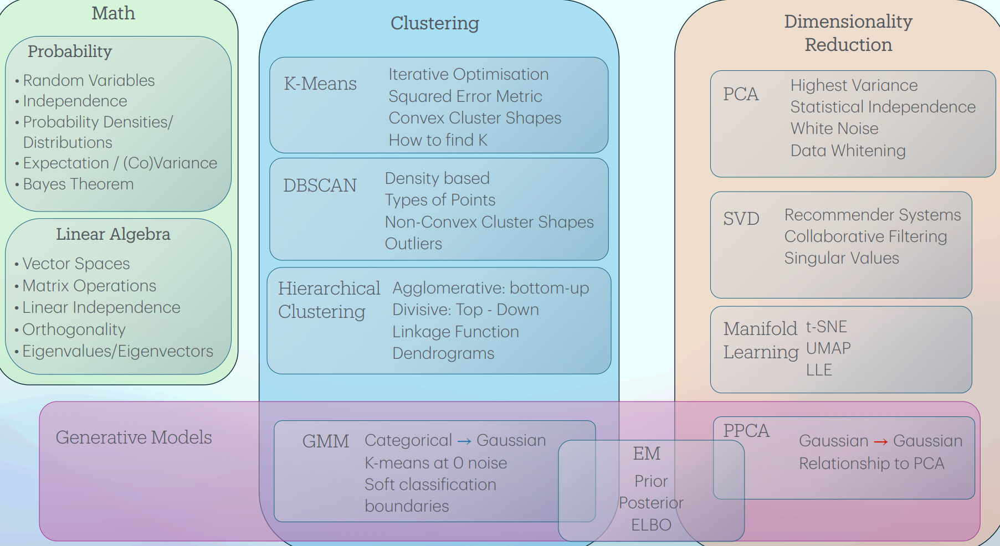

# Unsupervised Learning

## Introduction
The learning algorithm called **Unsupervised Learning**, depends on learning through many unlabelled data, to obtain information on the underlying properties, behaviours or patterns of said data.

... **Learning Representations** that enable efficient information acquisition.

The goals of unsupervised learning include:
* Group similar datapoints together, as **Clustering**.
* Simplify data by reducing the amount of variables while retaining important information, as **Dimensionality Reduction**.
* Identify the probability density of data, as **Density Estimation**.
* Detect data that does not belong in the typical data distribution, as **Anomaly Detection**.

## Probability
...