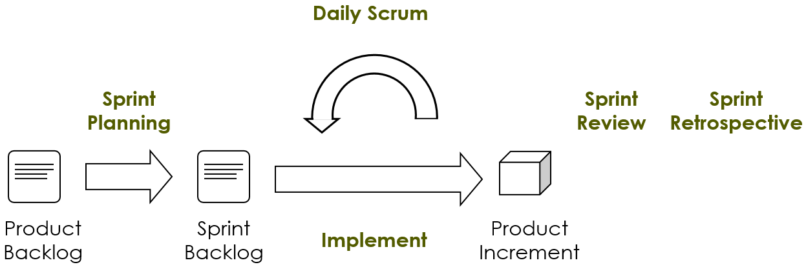
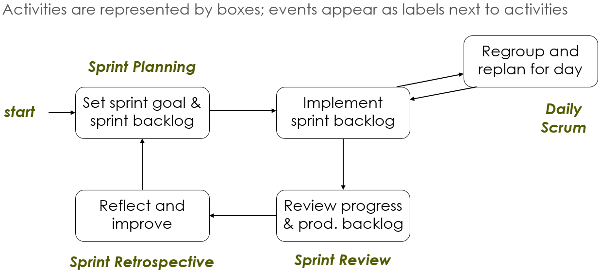
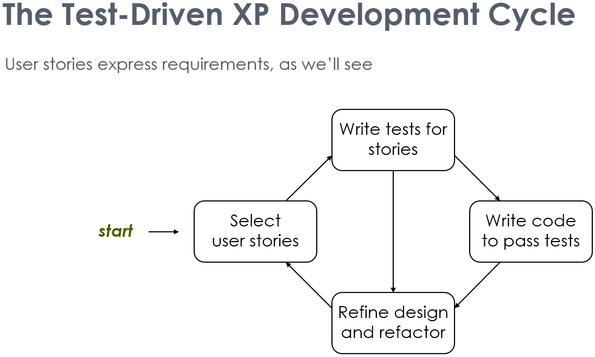
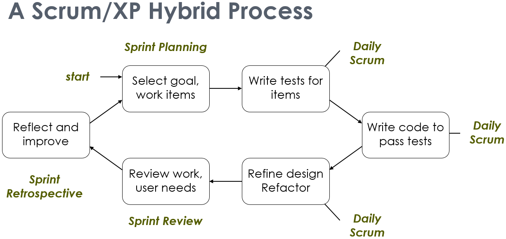

# Development Processes I

## Scrum
In Scrum, development is keyed to iterations, called **Sprints**. **Planning** and **Review** events are critical to ensuring implementation remains on track throughout a sprint. Additionally, Scrum specificies various **Roles** and **Artefacts**.

This is an overview on the Scrum process:

## Scrum Team: Roles
The **Product Owner** represents the voice of customer, they are a individual that manages the product backlog of work items (***i.e.*** the requirements), and set the goals of what to accomplish during a sprint.

The **Developers** have the flexibility to choose how they implement work items, with review events to ensure that they remain accountable to their work. They deliver potentially shippable product **'increments'** per sprint.

The **Scrum Master** organises and manages all the events, and respectively ensure its all on track. They also take responsibility for removing external impediments (***i.e.*** any external issues that is hindarance to the process). They are a single individual.

## Events
**Events** are things that happen ig idk ...

**Sprint Planning** is done for a few hours of time during a given (1-month) sprint, at the start of that sprint. It is led by the product owner, where they set sprint goals; and users define the value/priority of backlog items. The developers would estimate the effort for work items, and selecting what work items can fit into the sprint. This method selection is based on a cost-benefit analysis of the items.

**Daily Scrum** is done on the daily for a couple minutes during the sprint. Where each developer updates the group on:
* What they have done yesterday
* What they will do today
* What obstacles are present

The Scrum master would also then ensure that the obstacles of the day would be removed. **Obstacles** are external problems, so the Scrum master would need to sort it out; ***e.g.*** a bug with a service a supplier provides, which could delay the project, in which the Scrum master would need to contact the supplier and fix the issue.

**Sprint Review** is done for a short few hours during the sprint, notably at the end. Where the team reviews the product increment they worked on, and update the backlog to account for user feedback, or requirement changes.

**Sprint Retrospective** is done for a short few hours during the sprint. Where the team discuss improvements to the process for the next sprint; the product is not discussed at this point.

## Artefacts
There are three different Scrum **Artefacts**, which for transparency is often opened to all team members, and these are:
* **Product Backlog**, an ordered list of all work items that might be needed for the product.
* **Sprint Backlog**, items selected for meeting the sprint goal that is set during planning.
* **Product Increment**, sum of all product backlog iteams that are completed during the sprint.

## FAQs
Here are some frequently asked questions about the development process using Scrum:
...

## Agile Development with XP
**Extreme Programming (XP)** ...

There are four main XP activities:
* **Listening**, to what the users want from a system.
* **Testing**, making rigourous testing central to development
* **Coding**, by writing simple readable code
* **Design**, by refactoring the code to clean up the design and implementation.

