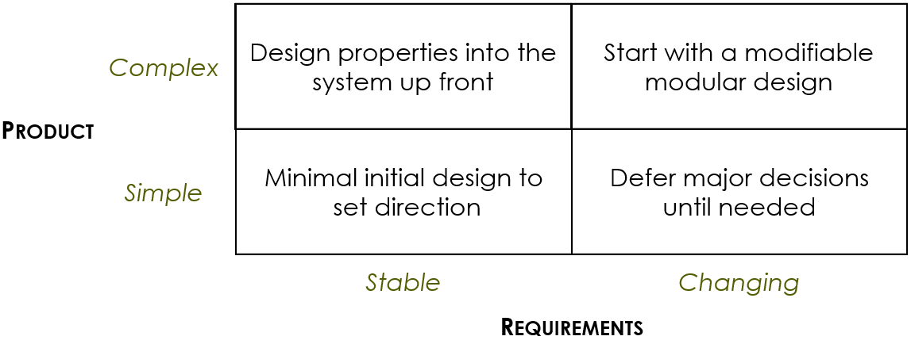
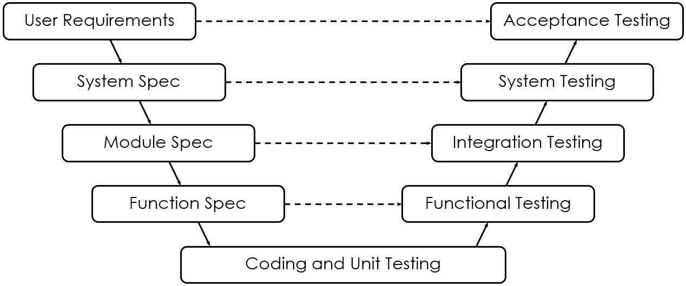

# Development Processes II

## Listening
**User Stories** describes the users' need in simple plain language, in the perspective of the user. A suitable template for user stories follows this format: *"As a **(role)** I want to **(actions)** so that **(benefits)**"*.

There are three C's to the purpose of a story:
* **Card**, identify a requirement, not capture all the details
* **Conversation**, aid discussions with the users, initially and during iteration planning
* **Confirmation**, confirm the story by writing one or more acceptable tests

## Testing
There are three forms of testing:
* **Acceptance Tests**, for user stories
* **Unit Tests**, for the code
* **Regression Tests**, for guarding against breaking existing functionality

Some additional advice, if tests are done after every change, it will increase confidence in the code. It aids debugging, since it can be easily be determined if that changed was faulty or broke something else in the code; and it enforces the fact that everything else in the code works fine, especially if suitable tests had already been done for those parts.

**Validation** is for checking the code for functionality, and meeting the requirements. This is done using **Acceptance Tests**, it is normally formatted as: *"Given **(initial context)**, and **(additional context)**, when **(triggering events)** then **(expected outcome)**, and **(another outcome)**"*.

**Verification** is for checking if the implementation is built correctly.

During test-driven development. Validation/acceptance tests are written before coding, and verification/additional tests are made after coding.

## Coding
In **Test-Driven Development**, developing code follows these basic steps:
* Run acceptance tests before coding. To ensure that when the code is actually developed, the tests will pass and fail exactly as expected.
* Then, write enough code to pass the tests. To ensure functionality; with additional unit tests, if necessary, to verify the correctness of the code.
* Then, refactor the code. To cleanup the design of the code.

**Clean Code Practises** are important, for readability and clarity in how the code works. Following the **XP** approach in these practises, it emphasizes simplicity, and that:
* The code **Fits its Purpose**, and that it does what it is intended to do, and nothing more.
* That it uses the **Simplest Solution** possible. I assume the most optimized solution, is also the simplest, but it shouldn't be the main focus of writing it.
* The code is **Clean and Readable**. At all times.
* Unnecessary **Frills and Functionality** that aren't needed at all, are to be **Avoided**.

**Pair Programming**, ...

**Refactoring** consists of a sequence of **Correctness-Perserving** changes:
* It **Restores Modularity**, so each module has a specific purpose.
* **Common Functionalities** are put into a single method/module.
* The **Control Flow** remains readable and predictable.
* The naming conventions of variables and modules **Reflects its Purpose**.
* And **Comments** are added for rationale, and an indication of what not to change.

## Design
The **'When'** in designing is important; designs themselves are integral in development, and a good design will very likely result in a good product. The timing matters so that: the information that has been gathered, like requirements and whatnot, will formulate the functionality of the code; but also that only enough information is given to not waste effort on requirements, and thus the code, that would not be needed.

The 'When' to design depends on the **Product** and **Requirements**:

## V Processes
The principles of **V Processes** is that:
* **Tests** are specified before coding begins.
* And **Testing** can begin when there is code to test.

**V Processes** are **Plan-Driven**, and its diagram is given by this:

## Recommendations
* Start with Scrum
* Add development practises from XP
* Add levels of testing from V Processes