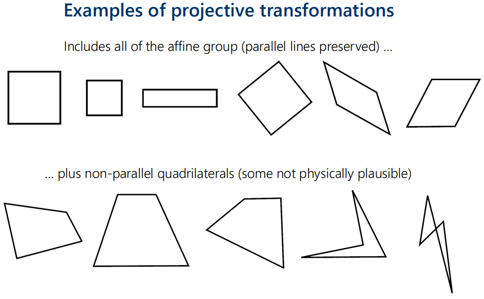
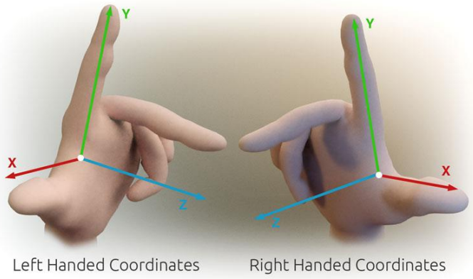

# 3D Transformation

## Projective Transformation
Recall that translation transforms for 2D points can be made into a **Linear** operation using **Homogeneous Coordinates**, using this:
$$\begin{bmatrix}p_1' \\ p_2' \\ 1\end{bmatrix} = \begin{bmatrix} a_{11} & a_{12} & t_1 \\ a_{21} & a_{22} & t_1 \\ 0 & 0 & 1\end{bmatrix} \begin{bmatrix}p_1 \\ p_2 \\ 1\end{bmatrix}$$
Which still allows the other transformations like rotation, scale, stretch and shear for 2D points.

But what if the bottom row is filled in, so that:
$$\begin{bmatrix} m_{11} & m_{12} & m_{13} \\ m_{21} & m_{22} & m_{23} \\ 0 & 0 & 1\end{bmatrix} \implies \begin{bmatrix} m_{11} & m_{12} & m_{13} \\ m_{21} & m_{22} & m_{23} \\ m_{31} & m_{32} & m_{33}\end{bmatrix}$$

Then, transformation equations would be done as:
$$s\begin{bmatrix} p_1' \\ p_2' \\ 1\end{bmatrix} = \begin{bmatrix} m_{11} & m_{12} & m_{13} \\ m_{21} & m_{22} & m_{23} \\ m_{31} & m_{32} & m_{33}\end{bmatrix} \begin{bmatrix} p_1 \\ p_2 \\ 1\end{bmatrix}$$
Where $s$ is the scale factor.

Which will have three linear equations:
$$sp_1' = m_{11}p_1 + m_{12}p_2 + m_{13} \\ sp_2' = m_{21}p_1 + m_{22}p_2 + m_{23} \\ s = m_{31}p_1 + m_{32}p_2 + m_{33} $$

This still allows for 2D transformations to be possible, which include the usual transforms; but also enables other, sometimes not physically plausible, transformations. As shown below:

## Homographies
...

## 3D Coordinate Systems
Unless otherwise stated, the **Right-Handed** 3D coordinate system will be used. Which is done as shown:

Rotating a 3D point about the z-axis is given by:
$$\begin{bmatrix}x' \\ y' \\ z'\end{bmatrix} = \begin{bmatrix} cos\theta & -sin\theta & 0 \\ sin\theta & cos\theta & 0 \\ 0 & 0 & 1\end{bmatrix} \begin{bmatrix}x \\ y \\ z\end{bmatrix}$$
Important note is that the coordinate is no longer homogeneous, since the bottom row value is not one.

Similar rotations about the other axises are given by:
$$\begin{bmatrix}z' \\ x' \\ y'\end{bmatrix} = \begin{bmatrix} cos\theta & -sin\theta & 0 \\ sin\theta & cos\theta & 0 \\ 0 & 0 & 1\end{bmatrix} \begin{bmatrix}z \\ x \\ y\end{bmatrix}$$
$$\begin{bmatrix}y' \\ z' \\ x'\end{bmatrix} = \begin{bmatrix} cos\theta & -sin\theta & 0 \\ sin\theta & cos\theta & 0 \\ 0 & 0 & 1\end{bmatrix} \begin{bmatrix}y \\ z \\ x\end{bmatrix}$$
For about the $y$ and $x$ axises respectively.

**Arbitrary Rotations** about the origin for 3D points can be done using the 3D rotations about each axis, and combining it to form the arbitrary rotation. Where $R = R_z(\psi)R_y(\phi)R_x(\theta)$; note the order still matters.

**Euler Angle Rotation** representation is given by:
$$p' = R_z(\psi)R_y(\phi)R_x(\theta)p$$

A **Gimbal** is a rotation frame device that can rotate in one axis. Three gimbals are normally used to rotate at each axis, and they are mounted within one another. A problem however is that if the center gimbal is 'locked', specifically such that $R_y = 90\degree$, the other axises can no longer rotate differently to one another. So the axis of rotation becomes the same.

**Homogeneous Coordinates** in 3D for translation transformations can be given by:
$$\begin{bmatrix}p_1' \\ p_2' \\ p_3' \\ 1\end{bmatrix} = \begin{bmatrix} 1 & 0 & 0 & t_1 \\ 0 & 1 & 0 & t_2 \\ 0 & 0 & 1 & t_3 \\ 0 & 0 & 0 & 1 \end{bmatrix} \begin{bmatrix}p_1 \\ p_2 \\ p_3 \\ 1\end{bmatrix}$$

**3D Affine Transformations** are given by:
$$\begin{bmatrix}p_1' \\ p_2' \\ p_3' \\ 1\end{bmatrix} = \begin{bmatrix} m_{11} & m_{12} & m_{13} & m_{14} \\ m_{21} & m_{22} & m_{23} & m_{24} \\ m_{31} & m_{32} & m_{33} & m_{34} \\ 0 & 0 & 0 & 1 \end{bmatrix} \begin{bmatrix}p_1 \\ p_2 \\ p_3 \\ 1\end{bmatrix}$$
Where there are 12 degrees of freedom