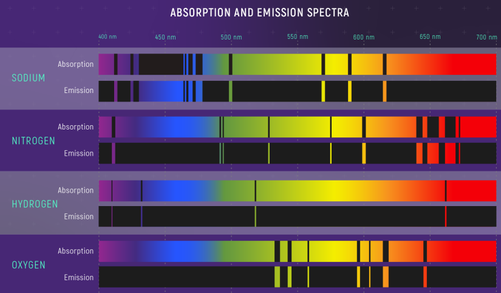

# Colour Spaces

## Physics of Colour
Light is an electo-magnetic wave, and or a photon particle. Light has a frequency and it determines the colour we see.

Humans can only see wavelengths between 380nm to 750nm, which is only a small portion of the electromagnetic spectrum. This portion is referred to as the **Visible Spectrum**. The wavelength/frequency of light determines what colour is perceived to humans. Human eyes also have different sensitivities to light, our vision is **Trichromatic**. Our eyes have **Cones**, which perceives the colour of objects; our eyes also have **Rods**, which are more sensitive to light, but the colour it perceives is monochromatic; or in black and white, especially in the dark.

Other technologies can 'see' the rest of the spectrum, from long radio waves to gamma rays.

Objects that interact with light can only either **Emit**, **Reflect** or **Absorb** light. Objects differ drastically in how the object absorb and emit light of different wave lengths; as shown by the image below:

## Colour Spaces
**Colour Space** refers to the range of colours that are processed. Though technoglogies can cover the whole spectrum, most of the time, they're limited by the range of colours it can process; and so there can be different colour spaces it can process.

There are two approaches technologies can reproduce light:
* **Additive**, in which light of different wavelengths, primarily red, green and blue, are added together to form the colour of the light. Light is added onto an often perceived black object, to create the colours.
* **Subtractive**, in which light take away, using the wavelengths colour of cyan, magenta and yellow.

**Projectors** or screens uses the additive method. ...

**Printers** uses the subtractive method. ...

RGB and CYMK are not the only ways to describe the colour space, there is also:
* **Hue-Saturation-Value (HSV)**
* **Hue-Saturation-Lightness (HSL)**

Chroma and luminance ...

...