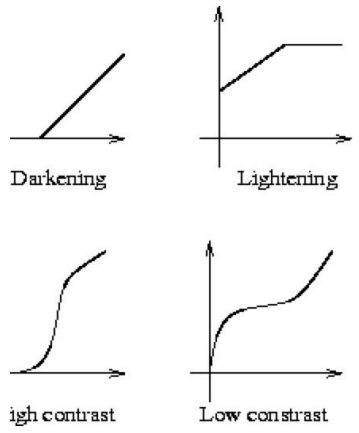
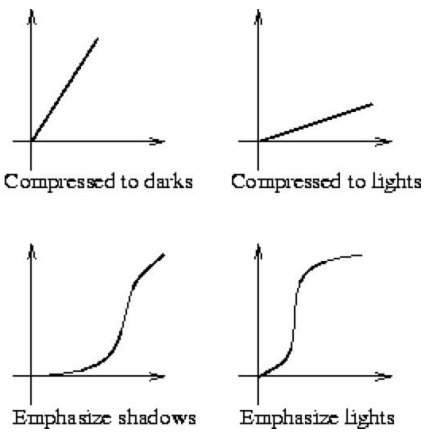
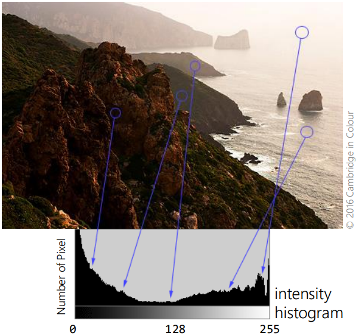

# Convolution and Image Filtering

## Image Filtering
**Image Filtering** allows for images to be altered to achieve a certain style or quality. Common filters that can be applied usually applies:
* Smoothing
* Photographic Styling
* Nonlocal Dehazing

As well as other unqiue changes like:
* Multiscale Tone
* Pensil Drawing
* And others (that i don't know the names of)

Image filtering often uses **Point-Based Filters**, that applies the same function to each point/pixel of an image. Some examples include:
* Lightening
* Darkening
* High Contrast
* Low Contrast
* Compressed to Darks
* Compressed to Lights
* Emphasize Shadows
* Emphasize Lights

Each with different functions that are used:

## Point Processing
Pixel values and their colours are represented by numbers. To process an image, the values must be **Quantized** for use in a computer; which defines the degree of precision of translating the real world into an image, as well as the amount of levels of intensity. In other words, the level of **Quantization** determines how accurate an image is to the real world, with regards to colour and light intensity. Usually 8-bit is sufficient for the colour depth of an image, but some other applications may instead use 10-bit, 12-bit, 16-bit or even 32-bit.

Considering an 8-bit colour depth, point processing an image would look like this:
* Inversion, $O(x,y) = 255 - I(x,y)$
* Contrast Enhancement, $O(x,y) = [\frac{I(x,y)-51}{0.6}]^{255}_0$

## Image Histograms
**Image Histograms** summarises the distribution of intensities of an image. Which is useful later for **Histogram Equilization**. An example of the histogram can be seen below:

**Histogram Equilization** ...

## Of-Point-Based Filters
...

## Gaussian Filters
...

## Convolution
...
