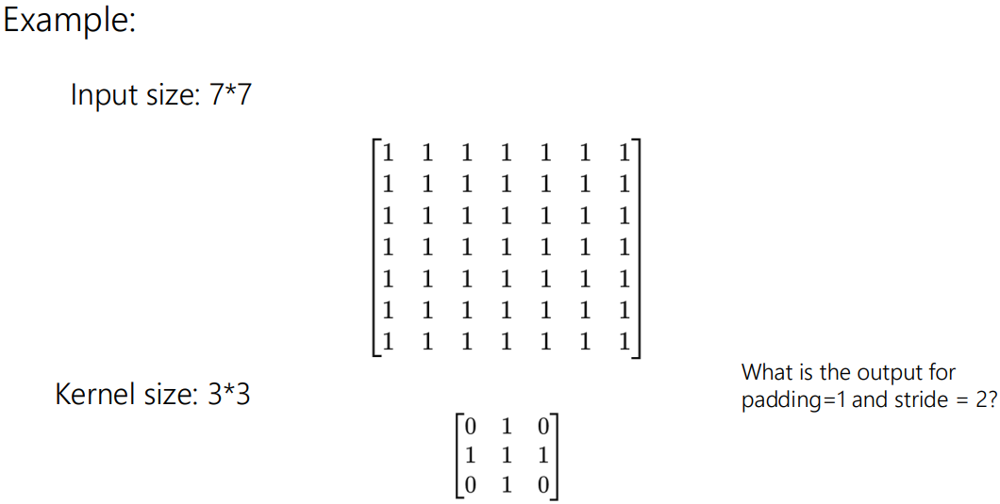

# Convolution and Image Filtering II

## Stride in Convolution
A **Stride** determines how much the kernel moves at each step during convolution. Where the **Output Size** is given by:

$$OutputSize = (\frac{InputSize-KernelSize}{Stride})+1$$

Below are some examples illustrating how it is used:

## Padding in Convolution
**Padding** is the process of adding extra rows and columns around the edges of the input matrix. This is done to control the output size or to preserve spatial dimensions. Which can be calculated by:

$$Padding = \frac{KernelSize-1}{2}$$

Combining **Strides** and **Padding**, the **Output Size** would be calculated as this:

$$OutputSize = (\frac{InputSize-KernelSize+2 \times Padding}{Stride})+1$$

Examples of both its uses are shown below:

## Dialated Convolution
**Dialated**, or **Atrous**, convolution introduces gaps (or "holes") between the elements of the convolutional kernel, allowing the kernel to cover a larger receptive field without increasing the number of parameters. As shown:

## Linear Filtering
...

## Other Filters
**Median Filtering** ...

**Morphological Filtering** ...

...

## Applications of Convolution
**Convolutional Neural Networks** are artificial NNs, that are inspired by organization of the **Visual Cortex**. Where there are multiple layers of convolutions, subsampling and other operations. "Learning convolution kernels from large amounts of training data".

**AI-Generated Content** (in short *AIGC*), ...

...